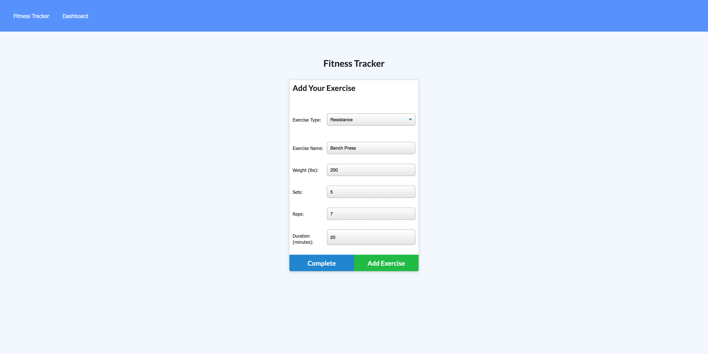
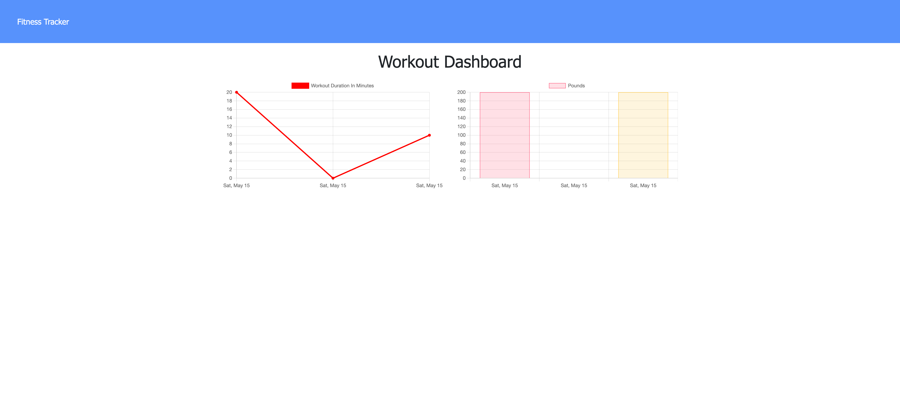
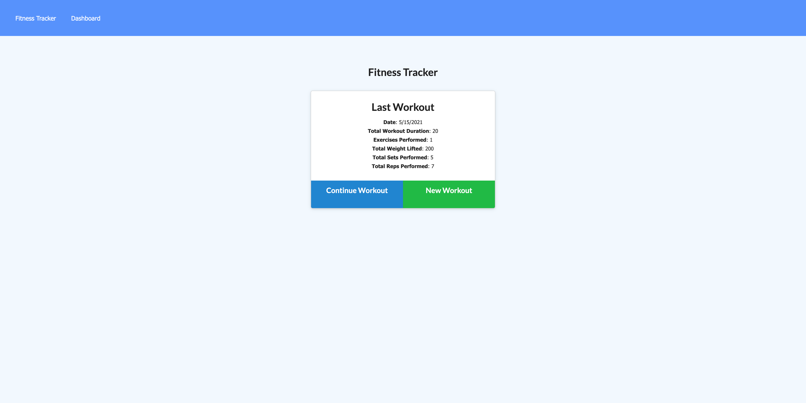

# Fittness_Tracker;
  

  ## Description 
An app that allows you to keep progress of your workout routines.
  ## Table of Contents 

  * [Installation](#installation)
  * [Usage](#usage)
  * [License](#license)
  * [Contributing](#contributing)
  * [Live Site](#Site)
  * [Contact](#contact)

  # Installation
  You must first install dependencies:
    npm i

  # Usage
  Start working on it, yourself! Clone it down.

  # License
  
  
  # Contributing
  Pull requests will be approved by Grayson Bloskas.

  # Site
  https://fittness-tracker-grayson.herokuapp.com/

  # Contact
  If you have questions, please contact me at the following: 

  
  GitHub: 

  graysonbloskas 

  Email 

  graysonbloskas@gmail.com 

  # Images

